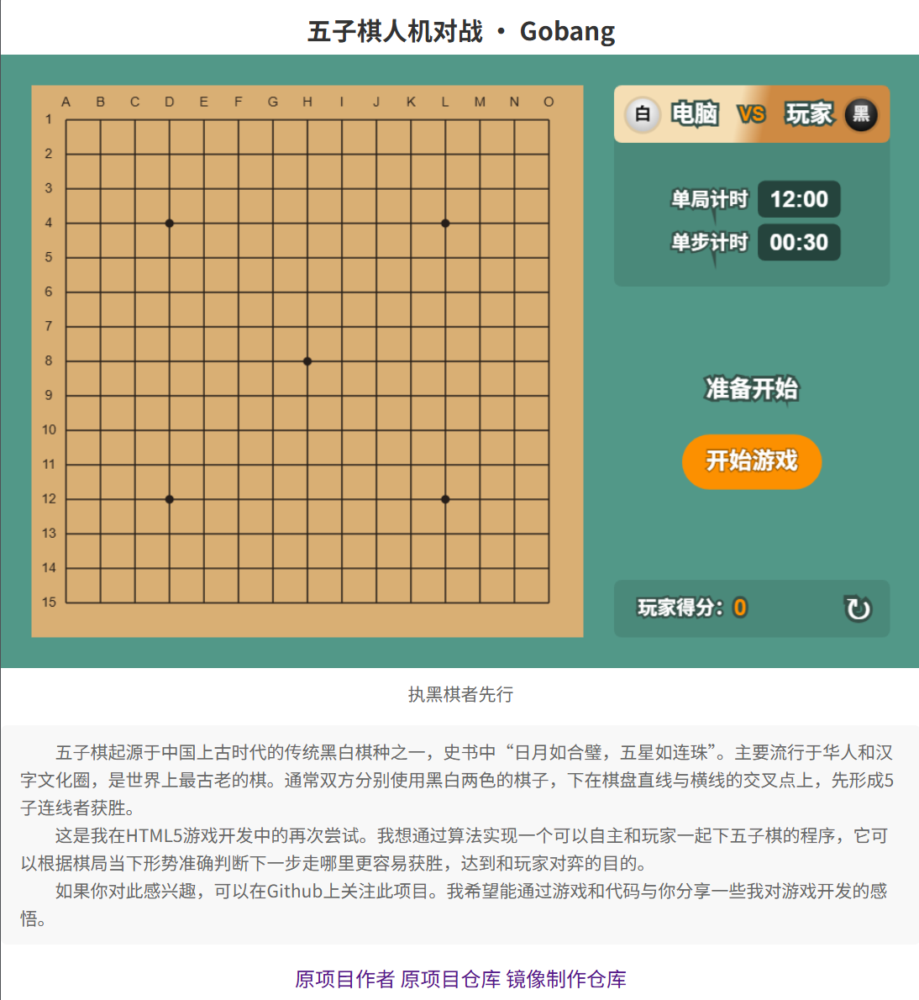

# Gobang 五子棋人机对战

- 项目演示(DEMO)地址：https://passer-by.com/gobang/

## 镜像说明

首先感谢原作者的开源。[原项目地址](https://github.com/mumuy/gobang)

本人提供这个项目在 NAS、服务器等的有偿远程部署服务，有需要可联系。  
微信号 `E-0_0-`  
闲鱼搜索用户 `明月人间`  
或者邮箱 `firfe163@163.com`  
如果这个项目有帮到你。欢迎start。

有其他的项目的汉化需求，欢迎提issue。或其他方式联系通知。

### 部署汉化项目

1. 从阿里云或华为云镜像仓库拉取镜像，注意填写镜像标签，镜像仓库中没有`latest`标签
   ```bash
   swr.cn-north-4.myhuaweicloud.com/firfe/gobang:2024.12.07
   ```

2. 部署  
   容器内部端口 3000
     - 命令部署
       ```bash
       docker run -d \
       --name gobang \
       --network bridge \
       --restart always \
       --log-opt max-size=1m \
       --log-opt max-file=3 \
       -p 3000:3000 \
       swr.cn-north-4.myhuaweicloud.com/firfe/gobang:2024.12.07
       ```
     - `compose.yaml`文件部署 👍推荐
       ```yaml
       #version: '3.9'
       services:
         gobang:
           container_name: gobang
           image: swr.cn-north-4.myhuaweicloud.com/firfe/gobang:2024.12.07
           network_mode: bridge
           restart: always
           logging:
             options:
               max-size: 1m
               max-file: '3'
           ports:
             - 3000:3000
       ```
## 修改说明

增加修改部分具体见 [修改说明](./修改说明.md)。

`./README.md` 增加 `## 镜像说明`、`## 修改说明`、`## 效果截图` 部分。

增加目录 `./图片`
新增文件 `./.dockerignore`、`./Dockerfile`、`./修改说明.md`  

## 效果截图




## 版权
本游戏由 [passer-by.com](https://passer-by.com/) 制作，请尊重作者，引用请注明来源。
